<p align="center">
  
</p>

<h1 align="center">LeetGraph</h1>

<p align="center">
  <b>LeetCode practice, built like a roguelike.</b><br />
  Pick a company, climb its map of real interview questions, and let the game keep you coming back.
</p>

<p align="center">
  <a href="https://leetgraph-iota.vercel.app/"><b>▶ Play it live</b></a>
</p>

<p align="center">
  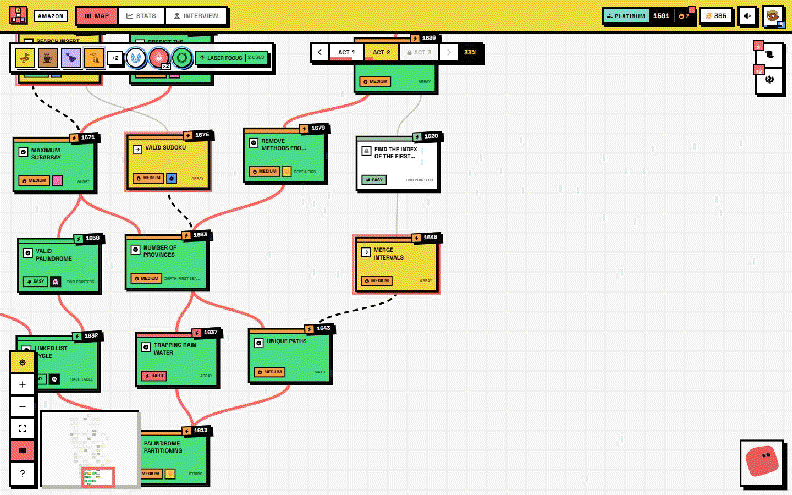
</p>

---

## Why

Grinding a random list of 150 problems is boring, and boring is how prep plans die in week two.
LeetGraph turns interview prep into a run:

- **Company-asked questions.** Each roadmap is generated from a real LeetCode company export
  (Amazon, Google, Apple, Meta). You practice what that company actually asks, ordered from
  warm-up to boss fight.
- **A map, not a list.** Problems are laid out as a Slay-the-Spire-style graph split into acts.
  Clearing a node opens the paths above it. Beat the act's boss to break into the next act.
- **Gamification that rewards the right habits.** A chess-style rating that only moves when you
  fight problems at your level. Streaks, rematches for problems you failed, daily quests,
  achievements, relics and a lot of screen shake.
- **Honest feedback.** Every attempt logs result, time by phase, hints, AI use and complexity,
  so the Stats tab can show *where* you actually break down.

## Tour

### Pick a company roadmap

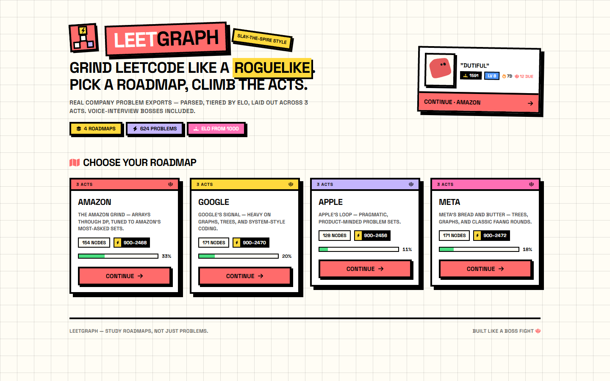

Four roadmaps, each with ~130–170 problems across 3 acts. New roadmaps unlock as you level up.

### Climb the map

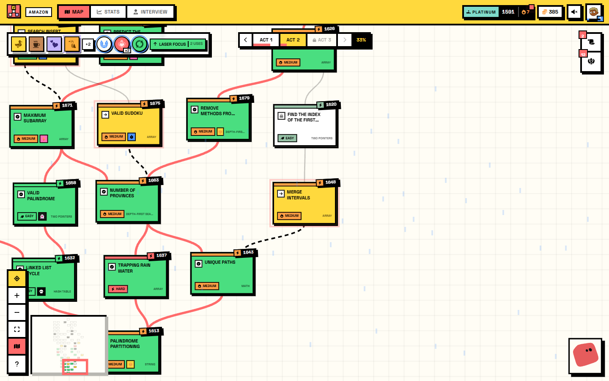

- **Green** = solved, **yellow** = available now, **dashed lines** = your next moves.
- Nodes carry modifiers: **Elite** (×1.5 rating), **Timed**, **Purist** (no hints/AI), plus
  daily auras and **mystery** nodes that roll a random event.
- Zoom out and the cards collapse into readable tokens, so a whole act fits on screen:

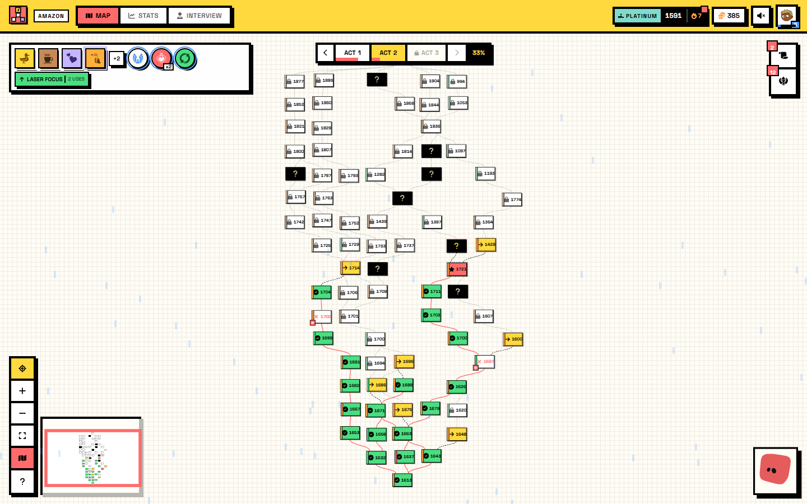

Pan with drag or the wheel, zoom with Ctrl+wheel or pinch. Press `N` to jump to your next node,
`F` to fit the act, and `[` `]` to switch acts. The minimap and the `?` legend live bottom-left.

### Log an attempt in two clicks

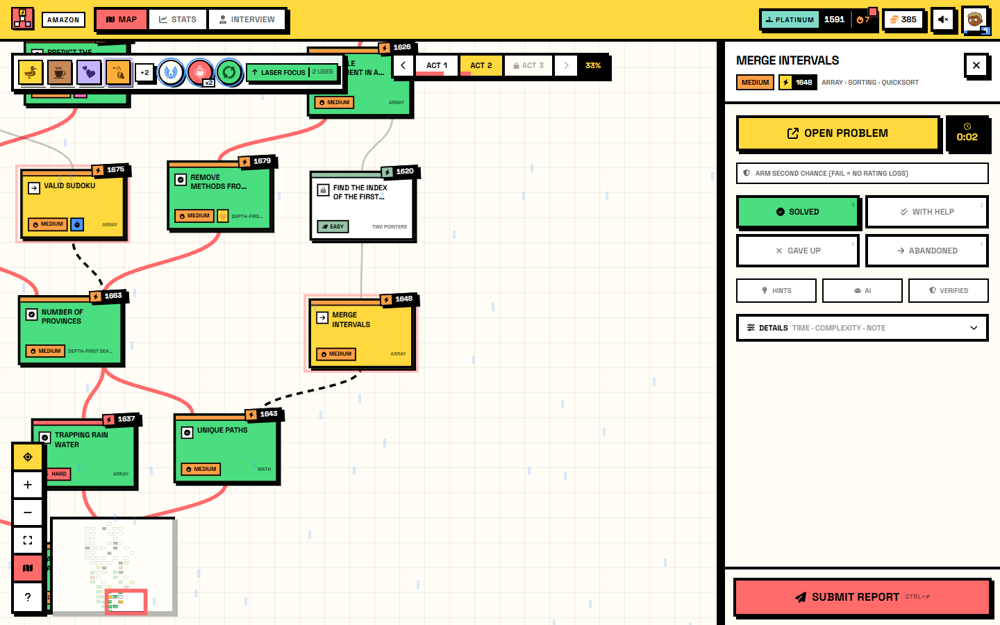

Open the problem on LeetCode, come back, pick a result and submit. A live clock fills in the time
for you. Phase times, complexity and notes are one click away under **Details**. Keys: `1`–`4`
pick the result, `Ctrl+Enter` submits.

Then the fun part: confetti from the node, your rating ticks up, coins fly into your wallet, and
the next paths draw themselves in. Crits freeze the frame. Bosses shake the screen.

### Find your weak spots

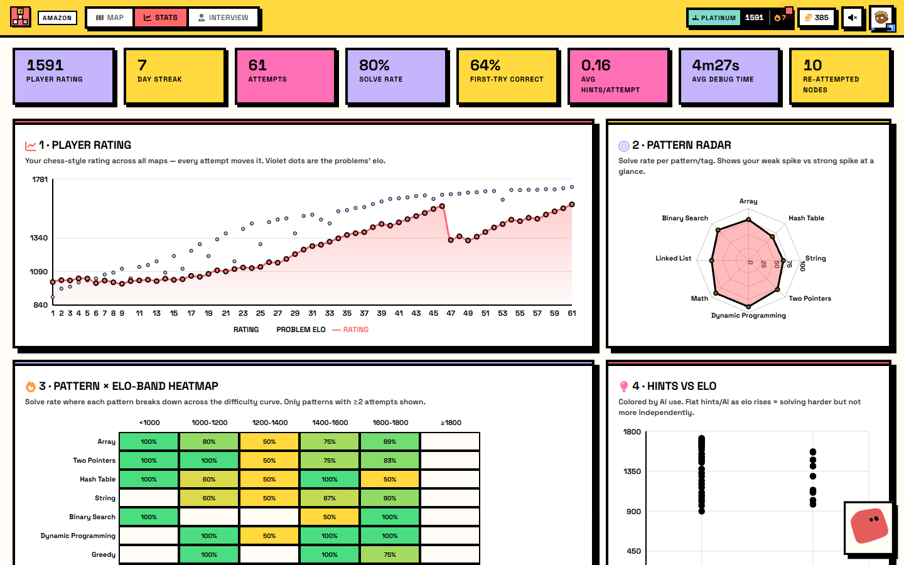
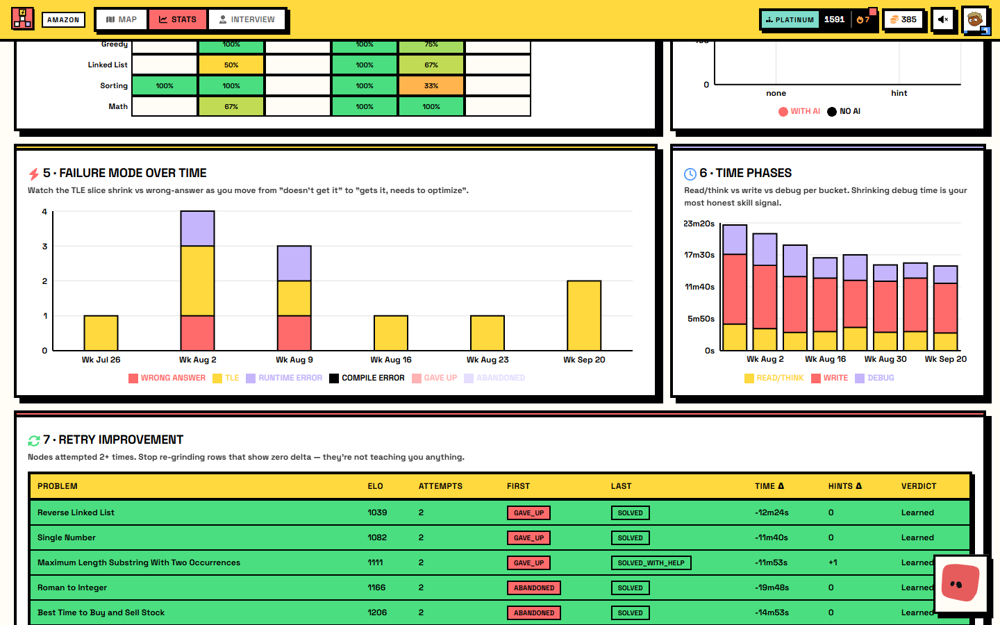

- **Rating over time** against the Elo of each problem you fought.
- **Pattern radar** and **pattern × difficulty heatmap**: see exactly where Dynamic Programming
  stops being green.
- **Failure modes** and **time phases**: are you failing on wrong answers or TLE? Is debugging
  shrinking?
- **Retry table**: which rematches actually taught you something.
- The full **achievement** catalog, with the coach or relic each one unlocks.

### Build your run

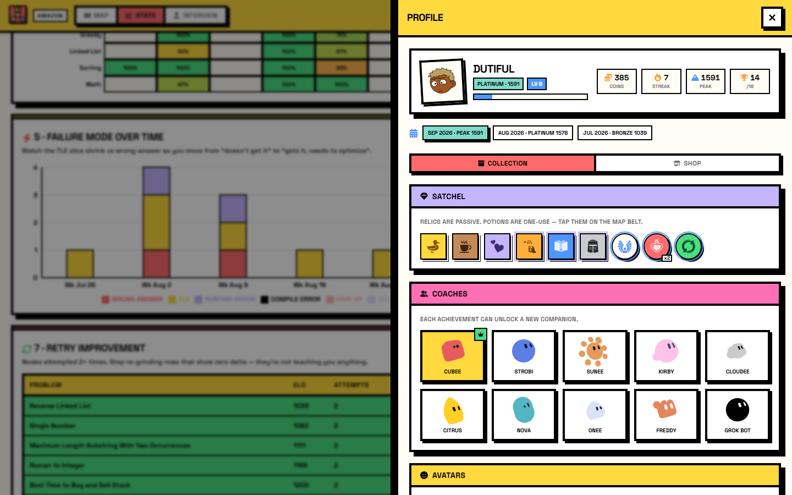 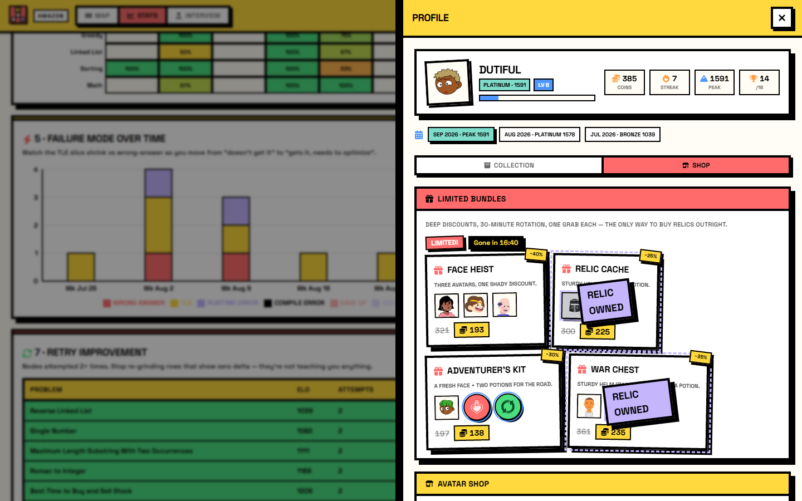

Relics give passive bonuses, potions are one-shot tools (Second Chance: a failed attempt costs no
rating), and coins buy avatars, potions and limited bundles. Ranks run from Bronze to
Grandmaster, with promotion series, monthly seasons and rating decay if you stop practicing.

### Mock interviews

The **Interview** tab runs a voice mock interview on any available node: a problem statement, a
code editor with a runner, a whiteboard, and an AI interviewer (ElevenLabs + Groq) that gives you
a verdict. Results feed straight into your rating.

### Works on your phone

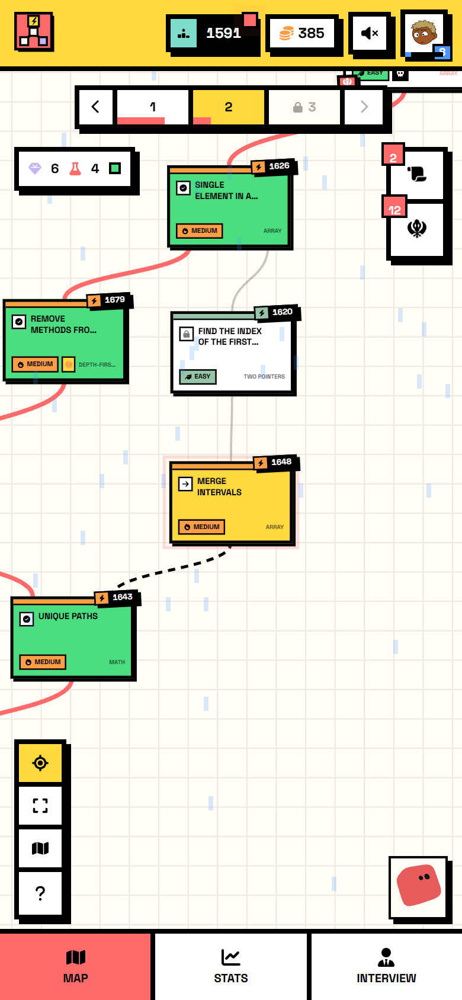 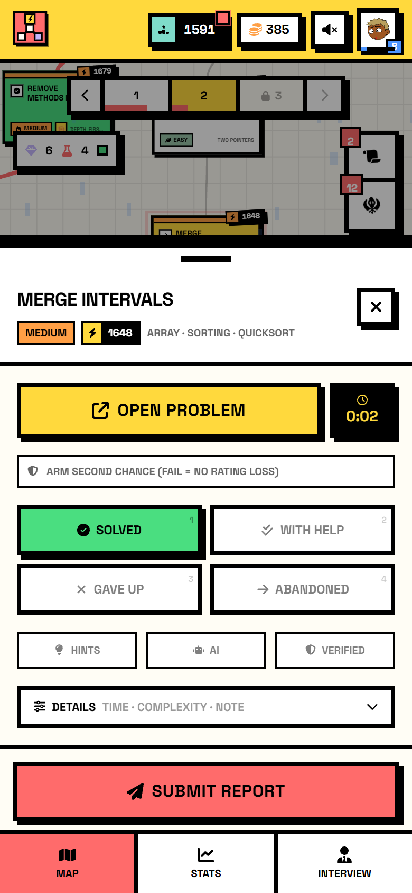

Bottom tab bar, bottom-sheet report panel, pinch zoom. It installs as a PWA.

## How the roadmaps are built

```
LeetCode company CSV ──▶ parseProblems ──▶ buildActsGraph ──▶ maps/<company>.json
```

- `parseProblems` gives each problem a difficulty-weighted **Elo** (900–2500) from acceptance
  rate, frequency and difficulty.
- `buildActsGraph` lays problems out as a StS map: randomized walks per act that funnel into one
  boss node, bridged into the next act. Problems are placed row by row by Elo, so difficulty
  ramps as you climb.
- The JSON stores layout and slugs only. At runtime each map re-parses its CSV, so the CSV stays
  the source of truth.

## Tech

React 18 + TypeScript + Vite, Tailwind (neo-brutalist theme), React Flow for the map,
Framer Motion plus a small canvas particle engine for effects, Recharts for stats, Supabase for
auth and cloud sync, Groq and ElevenLabs for the interviewer. Deployed on Vercel.

## Develop

```bash
npm install
npm run dev      # vite dev server
npm run build    # tsc -b && vite build
npm run preview  # serve the production build
```

Without any env vars the app runs in **local-only mode**: no sign-in, progress lives in
localStorage. To enable everything, create `.env.local`:

```bash
VITE_SUPABASE_URL=...
VITE_SUPABASE_ANON_KEY=...
VITE_GROQ_API_KEY=...
VITE_GROQ_TEXT_MODEL=...
VITE_GROQ_VISION_MODEL=...
VITE_ELEVENLABS_AGENT_ID=...
```

The database schema is in [`supabase/schema.sql`](supabase/schema.sql).

### Demo data

To see the UI with a realistic two-month history (like the screenshots above), open the dev
server in local-only mode and run this in the browser console:

```js
const s = await import("/scripts/seedDemo.js"); await s.seed(); location.reload();
```

`s.clear()` wipes it again.

### Regenerate maps

Add or update a company CSV in `maps/` (`<company>.csv`), then:

```bash
npx tsx scripts/genGraph.ts
```
